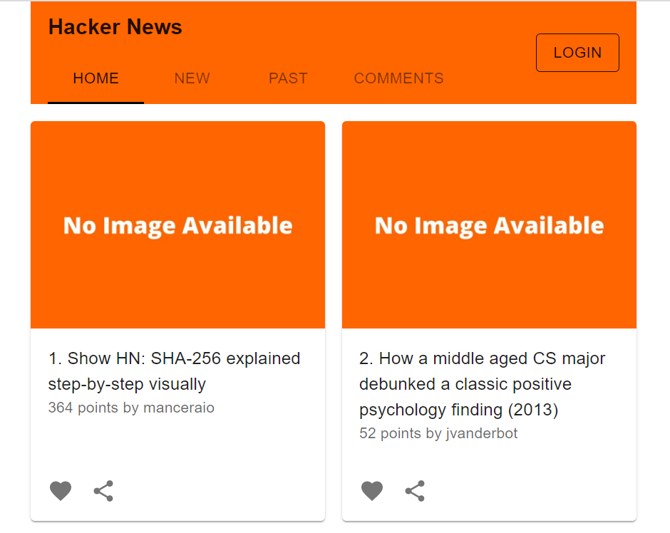
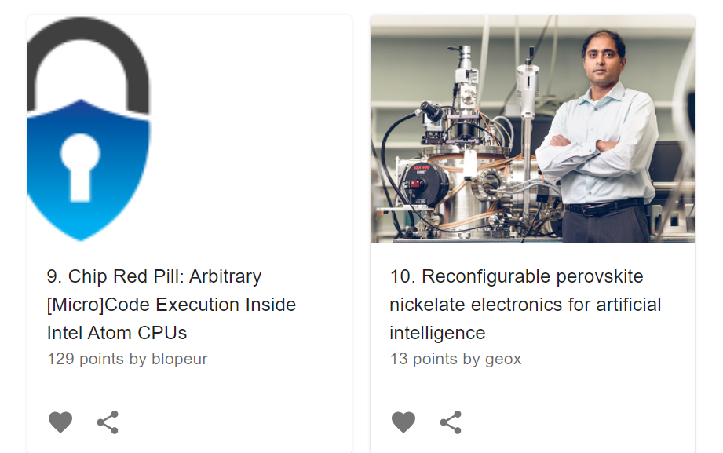

# Mock Hacker News

### <a href="https://mock-hacker-news.vercel.app/" target="_blank">Link to the mock website</a>

### What is <a href="https://mock-hacker-news.herokuapp.com/" target="_blank">Hacker News</a>
Hacker News is a social news website focusing on computer science and entrepreneurship.

## Project Description
The project utilise several Meterial-UI components for user interface.  
Node server is used to get the metadata about a website so that the preview of the image can be shown.

## Tools
- React with Typescript
- Node/Express
- [Hacker News API](https://hackernews.api-docs.io/)

## To serve the front-end by having node server up and running ONLY (no front-end server started)
on Windows PowerShell
> set PUBLIC_URL=http://localhost:3001;npm run build

on Linux/Mac
> PUBLIC_URL=https://dsomething.cloudfront.net npm run build
